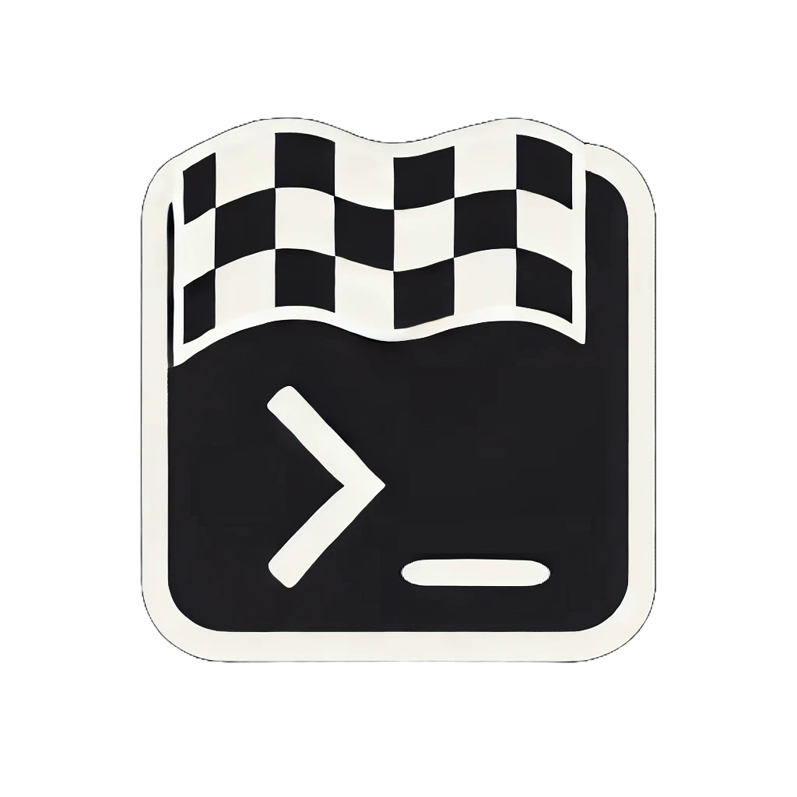
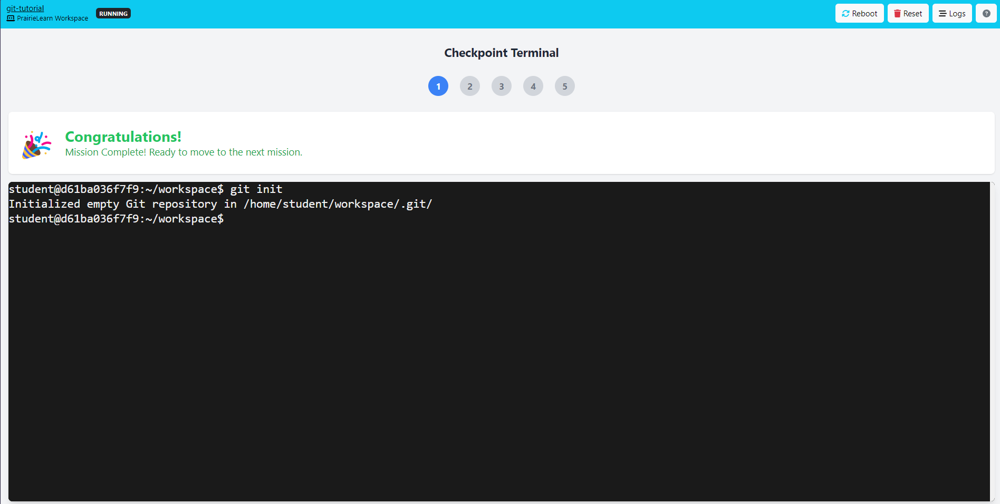

# Checkpoint 🎯

<p align="center">
  
</p>

Checkpoint helps you create step-by-step, mission-based tutorials in PrairieLearn. Students learn through hands-on practice in a terminal environment, receiving instant feedback as they progress through each mission. Unlike traditional tutorials, Checkpoint actively monitors student progress and provides immediate validation when they successfully complete each step.

## ✨ Quick Start

Let's dive into an interactive Git tutorial! We've created a hands-on learning experience where students:

🔸 Start with the basics of version control  
🔸 Initialize their first Git repository  
🔸 Learn about staging files and making commits  
🔸 Get instant feedback as they progress  

### 1️⃣ Installation

```bash
pip install -e .
```

### 2️⃣ Docker Setup

Before deploying, login to Docker Hub:
```bash
docker login
```

### 3️⃣ Tutorial Configuration

Take a look at [`examples/questions/git-tutorial/checkpoint.yaml`](examples/questions/git-tutorial/checkpoint.yaml):

```yaml
title: Git Basics Tutorial
topic: Version Control
tags:
  - git
  - terminal

image:
  registry: andylizf
  name: git-tutorial
  base: ubuntu:22.04

runtime:
  program: bash
  packages:
    - git
    - nano
    - openssh-client

flags:
  - title: Initialize Git Repository
    prompt: "Mission 1: Create Your First Git Repository"
    description: |
      Let's start by creating a new Git repository...

# See the full file for more missions...
```

This single file defines our entire Git tutorial structure!

### 4️⃣ Deploy the Tutorial

```bash
cd examples/questions/git-tutorial
checkpoint deploy
```

### 5️⃣ Launch PrairieLearn

```bash
cd ../../.. # Move to the root of the Checkpoint repo
docker run -it --rm -p 3000:3000 -v "${PWD}/examples:/course" -v "${PWD}/examples/pl_ag_jobs:/jobs" -e HOST_JOBS_DIR="${PWD}/examples/pl_ag_jobs" -v /var/run/docker.sock:/var/run/docker.sock --platform linux/amd64 --add-host=host.docker.internal:172.17.0.1 prairielearn/prairielearn
```

### 6️⃣ Access the Tutorial

1. Open http://localhost:3000 and click the green "Load from Disk" button
2. On the homepage, select "PL Active Environment Runtime" under "Courses with instructor access"
3. Open the Git tutorial in the Questions panel and click "Open Workspace" to launch your interactive terminal

<p align="center">
  
</p>

The terminal provides a real Linux environment where you can practice Git commands and get instant feedback on your progress!

## 🛠️ Create Your Own Tutorial

Want to create your own tutorial? It's easy! Just:

1. Create a new `checkpoint.yaml` file
2. Define your Docker environment
3. Specify your learning missions
4. Deploy with `checkpoint deploy`

Check out [`examples/questions`](examples/questions) for more inspiration!

## 📄 License

MIT

---
<p align="center">
  Made with ❤️ for interactive learning
</p>
